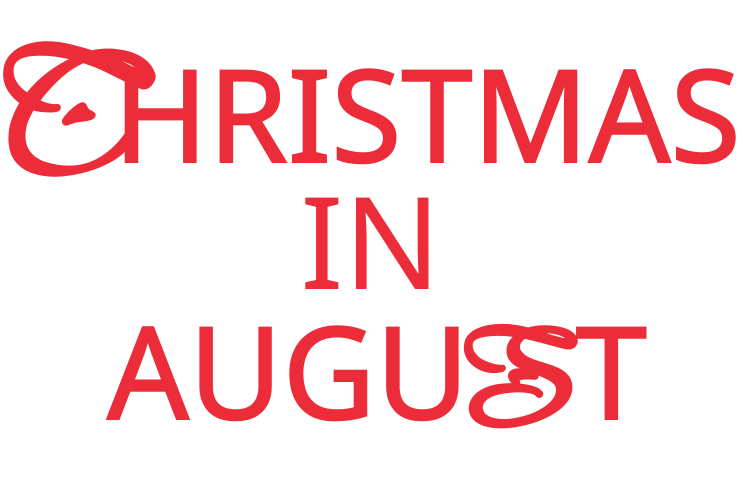

<h2 align="center">
    
   
    🎄 THE BOYZ 2nd Regular Album PHANTAST PART 01

</h2>

 

### Description

The Boyz's 2nd regular album PHANTASY Part 1, Christmas in August website production project  

🎁  
https://phantasy01-tbz.web.app/

 

### Design
#### Main View
For Christmas in August, I sketched ideas based on two images: "Summer" and "Christmas" 
From Summer, I use light blue background colors and bright corrections. 
From Christmas I use red color, snowflakes, trees, advent calendars, and ornament items. 

 
Logo: Red typography with snow  
 
Tree: As the biggest symbol of Christmas, the tree is the main image for this album. 
Therefore, the tree's ornament was symbolized for and icons are related to the songs.  
Clicking on each icon plays the corresponding song.  
Also, balls with the members’ symbolic colors were hung on the tree.   
 
Advent Calendar: Each of these activities contains the context of being a precious gift  
in the sense of receiving gifts every day while waiting for Christmas.  
When the icons on the calendar are clicked on,  
it will be connected to the videos of the album one by one.  
 
Member Ball: These balls were hanging on the tree.  
The order and composition of balls were taken from the choreography movement.  
When clicked, it connects to each member page. 
 

   
